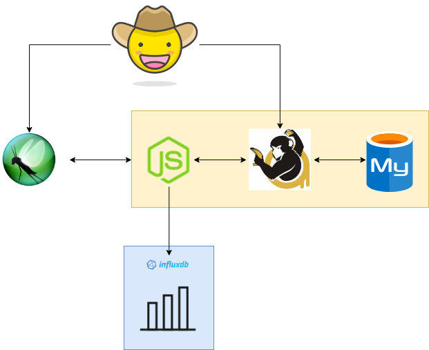

# chaos-engineering-playground
## Motivation
No matter if you work for any the **GAFAM**, a medium-sized company or a startup, we live in a world where microservices and distributed systems are part of the day-to-day job of a **Software Engineer** and where **Software Testers/Automated QA** are not widely present in the workforce.

In this context, we need to make use of all the tools that are available to us to prevent issues from impacting *Production* environments and therefore our customers.

My goal with this pet-project is to be able to bring and evangelize **Chaos engineering** to work and ensure we all build highly available and resilient services. However, I will also take this opportunity to write a blog series (SoonTM) and share my learnings with the rest of the community.

## What is Chaos Engineering?
Based on Wikipedia's definition:
> Chaos engineering is the discipline of experimenting on a software system in production in order to build confidence in the system’s capability to withstand turbulent and unexpected conditions.

In practice, Chaos Engineering can be thought of as the facilitation of experiments to uncover systemic weaknesses. These experiments follow four steps:
- Start by defining "steady state" as some measurable output of a system that indicates normal behavior.
- Hypothesize that this steady state will continue in both the control group and the experimental group.
- Introduce variables that reflect real world events like servers that crash, hard drives that malfunction, network connections that are severed, etc.
- Try to disprove the hypothesis by looking for a difference in steady state between the control group and the experimental group.

## The app
To run the experiments against something that can be somewhat representative of a "real-life" service, I decided to build a small app with:
- An HTTP API endpoint.
- [MySQL](https://github.com/mysql/mysql-server) database.

Even with this small example, we can easily reproduce issues that will impact any application with a similar architecture and find ways to mitigate them.

The architecture can be summarized with the following diagram:

## The tools
There are a few open-source tools that I will use to run the experiments and visualize the results:
- [Toxiproxy](https://github.com/shopify/toxiproxy): to generate chaos between the API and the database.
- [Locust](https://github.com/locustio/locust): to generate traffic against the API.
- [InfluxDB](https://github.com/influxdata/influxdb) + [Grafana](https://github.com/grafana/grafana): to capture application metrics and visualize them.
- [Docker](https://github.com/docker) + [Docker Compose](https://github.com/docker/compose): to be able to run everything on my laptop.

## Sources
- [Wikipedia](https://en.wikipedia.org/wiki/Chaos_engineering)
- [Principles of Chaos](https://principlesofchaos.org/)
